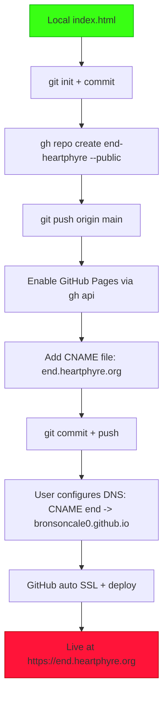

# Deployment Plan: Publish to end.heartphyre.org

## Context
- Current project: Single-file static site (`index.html`) with embedded Spotify player, acid/corrosion theme, animations.
- Target: `https://end.heartphyre.org`
- GitHub username: `bronsoncale0`
- User has `gh` CLI authenticated.
- User owns `heartphyre.org` DNS (will configure CNAME or A records).

## Goals
- Create GitHub repo `end-heartphyre` (or `end.heartphyre.org`).
- Enable GitHub Pages with custom domain.
- Add `CNAME` file for `end.heartphyre.org`.
- Push `index.html` + assets.
- Provide DNS instructions for user to point domain to GitHub Pages.

## Step-by-Step Execution Plan (for Code Mode)

1. **Initialize local git repo** (if not already):
   - `git init`
   - `git add index.html plans/`
   - `git commit -m "Initial Heartphyre site"`

2. **Create GitHub repo via `gh`**:
   - `gh repo create end-heartphyre --public --source=. --remote=origin --push`

3. **Configure GitHub Pages**:
   - Enable Pages in repo settings (branch: `main`, folder: `/ (root)`).
   - Or via CLI: `gh api repos/bronsoncale0/end-heartphyre/pages -X POST -f source[branch]=main -f source[path]=/`

4. **Add custom domain**:
   - Create `CNAME` file containing: `end.heartphyre.org`
   - Commit and push: `git add CNAME && git commit -m "Add custom domain" && git push`

5. **DNS Configuration** (user action):
   - For apex or subdomain:
     - Recommended: CNAME record `end` → `bronsoncale0.github.io` (or the Pages URL).
     - Or A records to GitHub's IPs if apex domain.
   - Wait for DNS propagation (5-30 min).
   - GitHub will issue SSL cert automatically (HTTPS).

6. **Verify**:
   - Visit `https://end.heartphyre.org`
   - Confirm Spotify embed loads, animations work, mobile responsive.

## Mermaid Workflow Diagram

## Risks & Mitigations
- DNS propagation delay: Inform user to wait or use `dig` to check.
- GitHub Pages rate limits: Rare for static site.
- Spotify embed: Works on HTTPS; no mixed-content issues.
- No build step needed (pure static HTML).

## Post-Deployment
- Update `plans/heartphyre-plan.md` with live URL.
- Optional: Add README.md with project description.
- Future: Add more pages or analytics if needed.

**Status:** Ready for user approval. Once approved, switch to 💻 Code mode to execute the steps above.