# Heartphyre: Slam Webpage Implementation Plan

## Requirements Summary
- **Single self-contained HTML file**: `index.html` with embedded CSS and JS.
- **Theme**: Dark muriatic acid-inspired (corrosive blacks [#0a0a0a], dark greens [#003300], acid glow accents [#39ff14], subtle corrosion textures via CSS gradients and shadows).
- **Animations**: Subtle acid drip effects on title and section headings using pure CSS `@keyframes` (no images).
- **Responsive**: Mobile-first with CSS Grid/Flexbox, viewport meta.
- **Deployment**: GitHub Pages-ready (static `index.html`).
- **Content**: Provided text structured into header, 3 main sections, minimal footer.
- **No images/links**: Pure text and CSS effects.

## Page Structure
```
<!DOCTYPE html>
<html lang="en">
<head>
  <meta charset="UTF-8">
  <meta name="viewport" content="width=device-width, initial-scale=1.0">
  <title>Heartphyre: A Study in Coercive Control and Muriatic Misery</title>
  <style> /* Embedded CSS: theme, animations, layout */ </style>
</head>
<body>
  <header>
    <h1>Heartphyre: A Study in Coercive Control and Muriatic Misery</h1>
  </header>
  <main>
    <section id="control">
      <h2>Coercive Control</h2>
      <!-- Paragraphs 1-2 -->
    </section>
    <section id="misery">
      <h2>Muriatic Misery</h2>
      <!-- Paragraphs 3-4 -->
    </section>
    <section id="exploitation">
      <h2>Systemic Exploitation</h2>
      <!-- Paragraphs 5-6 -->
    </section>
  </main>
  <footer>
    <p>Exposing the truth.</p>
  </footer>
</body>
</html>
```

## Visual Theme Details
- **Background**: `linear-gradient(180deg, #0a0a0a 0%, #001100 50%, #003300 100%)` with subtle noise overlay via CSS filter or repeating gradient.
- **Typography**: `font-family: 'Courier New', monospace;` for corroded tech feel; `font-size` scales responsively.
- **Colors**:
  | Element | Color | Purpose |
  |---------|--------|---------|
  | Body BG | #0a0a0a | Deep black void |
  | Text | #e0e0e0 to #b0b0b0 | Faded, etched readability |
  | Accents/Headings | #39ff14 | Acid green glow (`text-shadow: 0 0 10px #39ff14`) |
  | Borders/Effects | #00aa00 | Corroded edges |
- **Animations**:
  - **Enhanced Drip**: Multiple sequential drips on `h1::before` and `h2::before` with easing (`cubic-bezier(0.25, 0.46, 0.45, 0.94)`), variable speeds, realistic acceleration.
  - **Glitch Effect**: On headings - duplicate text layers (`::after` with `mix-blend-mode`, slight position jitter, rapid color shifts between #39ff14/#00aa00/#ff0000, keyframes with `translateX/Y` noise.
  - **Scanlines**: Body `::after` overlay - repeating thin horizontal lines (`linear-gradient` repeating), animated scan (`background-position` shift or opacity pulse) for CRT feel.
  - **Corrosion**: Refine body filter animation (slower 30s cycle, subtler shifts).
  - **Section Entrance**: Staggered `opacity:0; transform:translateY(20px)` to `1/0` with delay per section.
  - **Link Hover**: Pulse glow + mini-drip + glitch shake.
- **Layout**: CSS Grid for main (`display: grid; grid-template-rows: auto 1fr auto;`), max-width container, centered.

## Mermaid Layout Diagram

```mermaid
graph TD
    A[html head: meta title style] --> B[body]
    B --> C[header h1 Title + drip]
    B --> D[main]
    D --> E[section#control h2 + p paras]
    D --> F[section#misery h2 + p paras]
    D --> G[section#exploitation h2 + p paras]
    B --> H[footer p]
    style C fill:#39ff14,stroke:#00aa00
    style E fill:#001100
    style F fill:#001100
    style G fill:#001100
```


## Content Breakdown
1. **Header**: Exact title.
2. **Section 1 (Coercive Control)**: Para 1 (Finn visionary...), Para 2 (rejecting efficient...).
3. **Section 2 (Muriatic Misery)**: Para 3 (common theft...), Para 4 (corrosive atmosphere...).
4. **Section 3 (Systemic Exploitation)**: Para 5 (most disturbing...), Para 6 (Heartphyre predatory...).
5. **Footer**: "Exposing the truth." or similar fire-and-forget sign-off.

## Next Steps for Code Mode
- Create `index.html` with full embedded content/CSS/JS.
- Test responsiveness and animations locally.
- Optimize for GitHub Pages (no server-side needs).

## Updated Todo List
**Current todos synced with system tracker:**
- [x] Implement initial Heartphyre webpage structure, theme, and basic animations in [`index.html`](index.html)
- [x] Analyze current animations and link styling issues
- [ ] Design enhanced drip animations for h1 and h2 (smoother easing, multiple sequential drips, realistic physics)
- [ ] Design glitch effects: layered text duplicates with jitter, color shifts, horizontal/vertical shakes on headings
- [ ] Design scanline effects: animated horizontal scanlines overlay (pseudo-element with repeating gradient, moving opacity)
- [ ] Add staggered entrance animations for sections (CSS fade-in/slide-up on load or scroll)
- [ ] Refine body corrode animation for subtlety (adjust timing, reduce intensity) and integrate scanlines
- [ ] Style footer link to match theme: use #39ff14/#00aa00 colors, add glow text-shadow, hover pulse/drip/glitch effect
- [ ] Ensure all improvements remain pure CSS, responsive across devices
- [ ] Update [`plans/heartphyre-plan.md`](plans/heartphyre-plan.md) with new animation details including glitch/scanline specs and optional updated Mermaid diagram
- [ ] Review plan with user and refine todo list
- [ ] Switch to code mode for implementation
