# Heartphyre: Slam Webpage Implementation Plan

## Requirements Summary
- **Single self-contained HTML file**: `index.html` with embedded CSS and JS.
- **Theme**: Dark muriatic acid-inspired (corrosive blacks [#0a0a0a], dark greens [#003300], acid glow accents [#39ff14], subtle corrosion textures via CSS gradients and shadows).
- **Animations**: Subtle acid drip effects on title and section headings using pure CSS `@keyframes` (no images).
- **Responsive**: Mobile-first with CSS Grid/Flexbox, viewport meta.
- **Deployment**: GitHub Pages-ready (static `index.html`).
- **Content**: Provided text structured into header, 3 main sections, minimal footer.
- **No images/links**: Pure text and CSS effects.

## Page Structure
```
<!DOCTYPE html>
<html lang="en">
<head>
  <meta charset="UTF-8">
  <meta name="viewport" content="width=device-width, initial-scale=1.0">
  <title>Heartphyre: A Study in Coercive Control and Muriatic Misery</title>
  <style> /* Embedded CSS: theme, animations, layout */ </style>
</head>
<body>
  <header>
    <h1>Heartphyre: A Study in Coercive Control and Muriatic Misery</h1>
  </header>
  <main>
    <section id="control">
      <h2>Coercive Control</h2>
      <!-- Paragraphs 1-2 -->
    </section>
    <section id="misery">
      <h2>Muriatic Misery</h2>
      <!-- Paragraphs 3-4 -->
    </section>
    <section id="exploitation">
      <h2>Systemic Exploitation</h2>
      <!-- Paragraphs 5-6 -->
    </section>
  </main>
  <footer>
    <p>Exposing the truth.</p>
  </footer>
</body>
</html>
```

## Visual Theme Details
- **Background**: `linear-gradient(180deg, #0a0a0a 0%, #001100 50%, #003300 100%)` with subtle noise overlay via CSS filter or repeating gradient.
- **Typography**: `font-family: 'Courier New', monospace;` for corroded tech feel; `font-size` scales responsively.
- **Colors**:
  | Element | Color | Purpose |
  |---------|--------|---------|
  | Body BG | #0a0a0a | Deep black void |
  | Text | #e0e0e0 to #b0b0b0 | Faded, etched readability |
  | Accents/Headings | #39ff14 | Acid green glow (`text-shadow: 0 0 10px #39ff14`) |
  | Borders/Effects | #00aa00 | Corroded edges |
- **Animations**:
  - **Enhanced Drip**: Multiple sequential drips on `h1::before` and `h2::before` with easing (`cubic-bezier(0.25, 0.46, 0.45, 0.94)`), variable speeds, realistic acceleration.
  - **Glitch Effect**: On headings - duplicate text layers (`::after` with `mix-blend-mode`, slight position jitter, rapid color shifts between #39ff14/#00aa00/#ff0000, keyframes with `translateX/Y` noise.
  - **Scanlines**: Body `::after` overlay - repeating thin horizontal lines (`linear-gradient` repeating), animated scan (`background-position` shift or opacity pulse) for CRT feel.
  - **Corrosion**: Refine body filter animation (slower 30s cycle, subtler shifts).
  - **Section Entrance**: Staggered `opacity:0; transform:translateY(20px)` to `1/0` with delay per section.
  - **Link Hover**: Pulse glow + mini-drip + glitch shake.
- **Layout**: CSS Grid for main (`display: grid; grid-template-rows: auto 1fr auto;`), max-width container, centered.

## Mermaid Layout Diagram

```mermaid
graph TD
    A[html head: meta title style] --> B[body]
    B --> C[header h1 Title + drip]
    B --> D[main]
    D --> E[section#control h2 + p paras]
    D --> F[section#misery h2 + p paras]
    D --> G[section#exploitation h2 + p paras]
    B --> H[footer p]
    style C fill:#39ff14,stroke:#00aa00
    style E fill:#001100
    style F fill:#001100
    style G fill:#001100
```


## Content Breakdown
1. **Header**: Exact title.
2. **Section 1 (Coercive Control)**: Para 1 (Finn visionary...), Para 2 (rejecting efficient...).
3. **Section 2 (Muriatic Misery)**: Para 3 (common theft...), Para 4 (corrosive atmosphere...).
4. **Section 3 (Systemic Exploitation)**: Para 5 (most disturbing...), Para 6 (Heartphyre predatory...).
5. **Footer**: "Exposing the truth." or similar fire-and-forget sign-off.

## Next Steps for Code Mode
- Create `index.html` with full embedded content/CSS/JS.
- Test responsiveness and animations locally.
- Optimize for GitHub Pages (no server-side needs).

## Updated Todo List
**Current todos synced with system tracker:**
- [x] Implement initial Heartphyre webpage structure, theme, and basic animations in [`index.html`](index.html)
- [x] Analyze current animations and link styling issues
- [ ] Design enhanced drip animations for h1 and h2 (smoother easing, multiple sequential drips, realistic physics)
- [ ] Design glitch effects: layered text duplicates with jitter, color shifts, horizontal/vertical shakes on headings
- [ ] Design scanline effects: animated horizontal scanlines overlay (pseudo-element with repeating gradient, moving opacity)
- [ ] Add staggered entrance animations for sections (CSS fade-in/slide-up on load or scroll)
- [ ] Refine body corrode animation for subtlety (adjust timing, reduce intensity) and integrate scanlines
- [ ] Style footer link to match theme: use #39ff14/#00aa00 colors, add glow text-shadow, hover pulse/drip/glitch effect
- [ ] Ensure all improvements remain pure CSS, responsive across devices
- [ ] Update [`plans/heartphyre-plan.md`](plans/heartphyre-plan.md) with new animation details including glitch/scanline specs and optional updated Mermaid diagram
- [ ] Review plan with user and refine todo list
- [ ] Switch to code mode for implementation

## Subtitle Addition: Quote Integration

### Goals
- Add user-specified quote as subtitle: "You can't be disabled and hope to have any kind of easy life."
- Position: Immediately under h1 in header for prominence.
- Structure: Use `<blockquote>` or `<p class="subtitle">` for semantic emphasis.
- Styling: Match theme – acid green glow, subtle glitch/drip, italicized monospace, centered, responsive sizing.
- Preserve single-file purity (no external assets).

### Proposed HTML (in [`index.html`](index.html))
```
<header>
  <h1>Heartphyre: A Study in Coercive Control and Muriatic Misery</h1>
  <blockquote class="subtitle">
    "You can't be disabled and hope to have any kind of easy life."
  </blockquote>
</header>
```

### Proposed CSS Additions
```
.subtitle {
  font-style: italic;
  color: #00aa00;
  text-shadow: 0 0 8px #39ff14;
  font-size: 1.2em;
  margin-top: 0.5em;
  text-align: center;
  position: relative;
  animation: glitch 3s ease-in-out infinite 1s;
}

.subtitle::before,
.subtitle::after {
  content: '';
  position: absolute;
  bottom: 100%;
  left: 50%;
  width: 1px;
  height: 0;
  background: linear-gradient(to top, transparent, #39ff14);
  transform: translateX(-50%);
}

.subtitle::before {
  animation: drip 5s cubic-bezier(0.25, 0.46, 0.45, 0.94) infinite 2s;
  left: 30%;
}

.subtitle::after {
  animation: drip 5s cubic-bezier(0.25, 0.46, 0.45, 0.94) infinite 3s;
  left: 70%;
}
```

### Mermaid Update Suggestion
```
graph TD
  A[html head] --> B[body]
  B --> C[header h1 + subtitle quote + drips]
  %% ... rest unchanged
```

**Impact:** Quote amplifies theme of systemic barriers/exploitation, styled to corrode into view.

## Text Content Improvements

### Goals
- Tighten wording for conciseness (reduce word count ~20-30% per section)
- Amplify impact with punchier sentences, active voice
- Strengthen muriatic acid/corrosion metaphors (etch, dissolve, corrode, ruins, ashes)
- Improve flow and rhetorical power while preserving original meaning
- Maintain single <p> per section for simplicity

### Section 1: Coercive Control {#control}

**Current (from [`index.html`](index.html:312)):**
```
Finn presented himself as a visionary leader, but the reality suggested a pattern of maintaining control by keeping his environment in a state of constant, convenient crisis. He appeared to have little interest in solving foundational problems, such as high insurance costs or broken appliances, as a functional home would have reduced the residents' dependence on his "leadership." Even the mechanical failures surrounding him felt suspiciously timed; for instance, a simple keyfob issue—which can be induced in seconds—was used as a justification to seize a partner's superior vehicle. By consistently rejecting efficient systems and professional expertise, he ensured that his peers stayed exhausted and financially drained, suggesting a preference for a broken kingdom over a successful partnership.
```

**Proposed:**
```
Finn masqueraded as a visionary leader, orchestrating constant crises to grip control. He ignored basics like insurance or appliances—lest functionality erode his "leadership." Suspicious breakdowns, like a seconds-to-sabotage keyfob, justified seizing partners' vehicles. Spurning efficiency and experts, he kept peers exhausted and broke, ruling corrosive ruins over equal partnership.
```

### Section 2: Muriatic Misery {#misery}

**Current (from [`index.html`](index.html:316)):**
```
The most harrowing evidence of this power dynamic was the use of coercive meetings—sessions where residents were forced to remain in a pressure chamber of thick, suffocating tension. To force someone to remain in a room for an hour while they are in visible distress, trapped in a "discussion" about essentially nothing, is not leadership; it is a calculated act of psychological exhaustion. While common theft is a simple transfer of value, this environment was negative-sum, meaning the total destruction of the group's well-being far outweighed any petty benefit he gained. This is the essence of Muriatic Misery: a corrosive atmosphere that etches away at a person's resources, confidence, and sanity until only the rawest nerves remain. Like the acid it is named for, this environment didn't just cause sadness; it dissolved the very tools and safety nets residents needed to survive. He essentially burned down the entire structure to provide a momentary warmth for himself, leaving others to navigate the wreckage and the legal fallout of a failure that served only his own interests.
```

**Proposed:**
```
Coercive meetings trapped residents in suffocating tension chambers, etching psyches hour by hour—not leadership, but calculated exhaustion. Theft shifts value; this was pure corrosion, obliterating well-being for petty gains. Muriatic Misery: acid fog dissolving resources, confidence, sanity to raw nerves. It stripped survival nets, not just sadness. He torched the house for fleeting embers, stranding others in ashes and legal fallout.
```

### Section 3: Systemic Exploitation {#exploitation}

**Current (from [`index.html`](index.html:320)):**
```
The most disturbing reality of this systemic exploitation is that it is often perfectly legal and hidden behind the language of "community." Law enforcement and society are trained to look for physical violence or discrete theft, but they often miss the "professional" who uses the mask of a visionary to facilitate a parasitic lifestyle. Heartphyre was a predatory architecture where people were viewed as extractable assets and expertise was treated as a threat to be neutralized. Ultimately, the only way to stop the corrosion is to speak candidly about the manipulation and mistreatment, exposing the visionary for the extractor he has always been.
```

**Proposed:**
```
This predation hides legally behind "community" veils. Society hunts bruises and thefts, blind to "visionaries" leaching lives. Heartphyre preyed on humans as assets, expertise as threats. Stop the etch: voice the abuse, unmask the extractor.
```

**Footer Suggestion (Current: [`index.html`](index.html:324)):**
- Current: `<p><a href="https://open.spotify.com/episode/6cMe6Rkv8SgjnXzhdW9Luu">End coercive control.</a></p>`
- Proposed: Keep as-is or tweak to "End the corrosion. [link]"

**Word Count Reduction:** ~25% average, sharper impact, consistent acid lexicon (etch, corrode, dissolve, ruins, ashes, fog).

**Status:** Discarded per user preference. Focus shifted to adding specific quote as subtitle.
